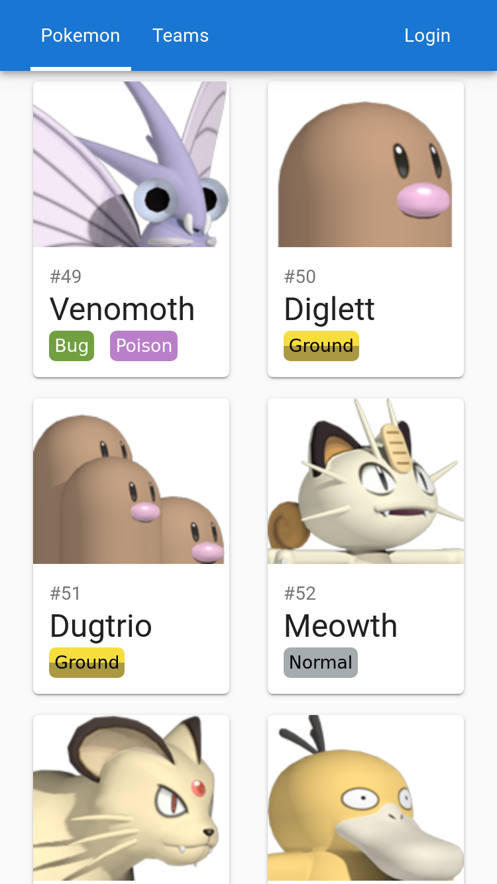
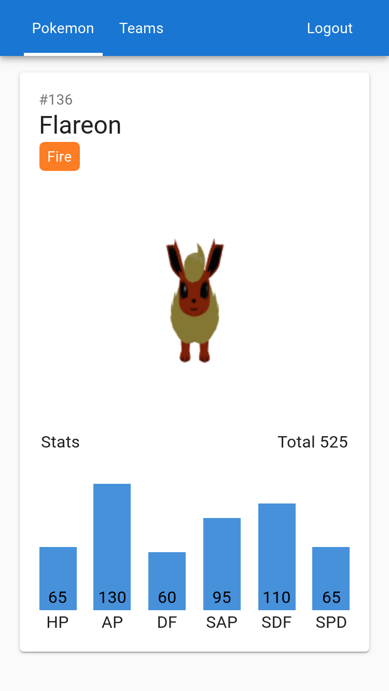
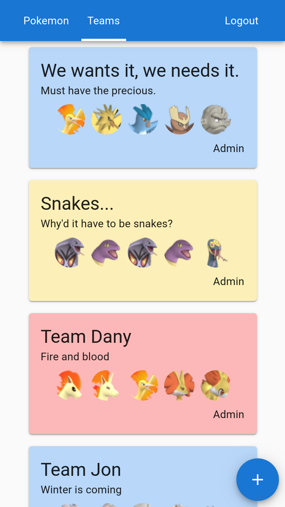
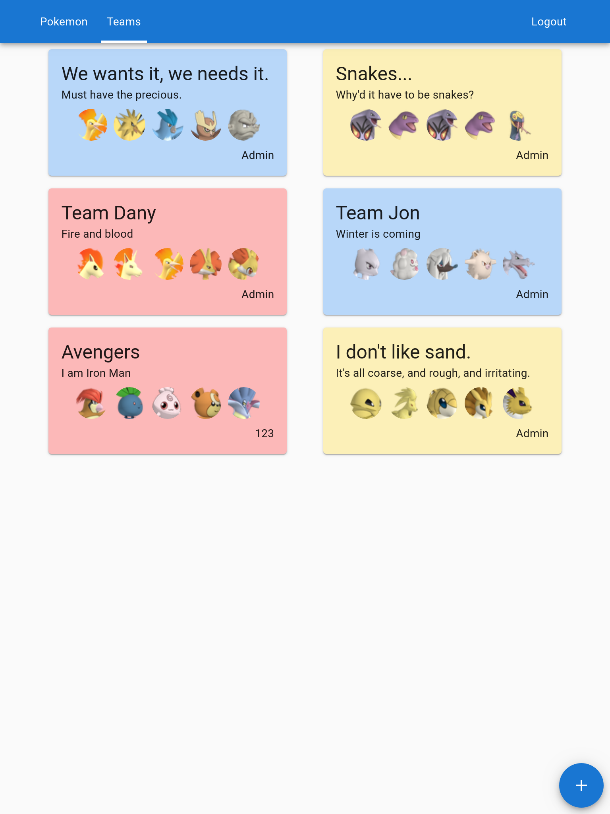
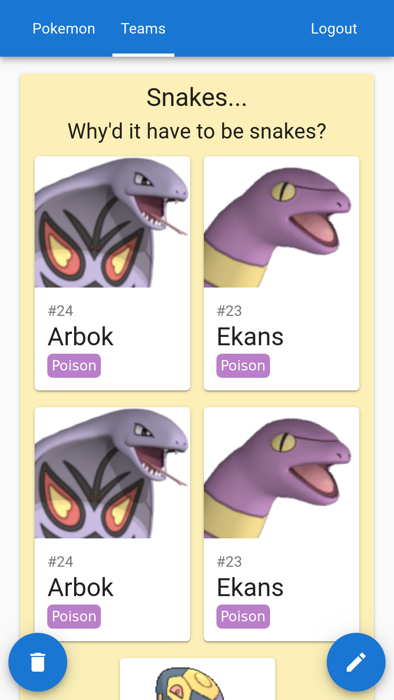

[](https://travis-ci.com/Nalhin/PokemonTeams)
[](https://codecov.io/gh/Nalhin/PokemonTeams)
[](LICENSE.md)

# Pokemon Teams

A website that allows users to create and share teams consisting of different Pokemon as well as previewing their interactive 3D models.

## Table of contents

* [Description](#description)
* [Features](#features)
* [Presentation](#presentation)
* [Folder Structure](#folder-structure)
* [Technology Stack](#technology-stack)
* [API](#api)
* [Setup](#setup) 
* [License](#license)

## Description

Website is written in Typescript utilizing React with Flux architecture (Redux).
Material UI was used as the component library of choice combined with Emotion for custom styles. 
Communication between frontend and backend was implemented with the use of REST API. 
Each request is handled with its own saga, and stored in Redux store for cache management.

Backend is written in Typescript utilizing Express framework. Authentication is implemented with http-only cookies (JWT).
As far as database is concerned, MongoDB was chosen, after the evaluation of data complexity (multiple relations were not needed).

## Features

* User authentication and authorization
* Interactive 3D models.
* CRUD functionality.

## Presentation

#### Overview

<p align="center">
  <a href="https://youtu.be/jDBPPlOJ_EU">
    
  </a>
</p>

#### Pokemon

<p align="center"> 
  
</p>

#### Single Pokemon

<p align="center"> 
  
</p>

#### Teams

<p align="center"> 
   
</p>
  
#### Teams Desktop

<p align="center"> 
  
</p>

#### Team
 
<p align="center"> 
  
</p>
    
## Folder Structure

#### Frontend

```
src
├── components (reusable components)
├── interfaces (typescript interfaces)
├── routes (routes with corresponding components)
├── store (redux store)
│   ├── modal 
│   ├── pokemon 
│   ├── snackbar 
│   ├── team 
│   └── user
│        ├── user.actions.ts 
│        ├── user.reducer.ts
│        ├── user.saga.ts 
│        ├── user.types.ts
│        └── user.api.ts
│      
├── styles (style constants)
├── utils (utility functions)
└── \__tests__ (test files are always located next to corresponding functionality)
```

#### Backend

Each module consists of the following files.
```
├── *.controller.ts (routes)
├── *.interface.ts (typescript definitions)
├── *.model.ts (mongoose model)
├── *.router.ts (express routes)
└── \__tests__ (test files are always located next to corresponding functionality)
```
## Technology Stack

#### App

* Typescript
* React
* React Router
* Redux
* Redux-Saga
* Three.js
* Emotion
* Material UI

#### Backend

* Node
* Typescript
* Express
* Mongodb
* Mongoose
* JWT

#### Testing

* Jest
* React Testing Library
* Supertest

#### Data

* Python
* Beautiful Soup
* Pillow 
* Zipfile

## API

[API Postman documentation](https://documenter.getpostman.com/view/8005247/SVtbRkgN?version=latest).

## Models, Images and Data

Models and images were downloaded from [this](https://www.models-resource.com/3ds/pokemonxy/) with web scrapping scripts.
After being downloaded, models are then converted to .glb format with open source converters ([fbx2glb](https://github.com/facebookincubator/FBX2glTF), [obj2glb](https://www.npmjs.com/package/obj2gltf), [collada2glb](https://github.com/KhronosGroup/COLLADA2GLTF)). 

Pokemon data was scrapped from [pokemondb](https://pokemondb.net/pokedex/all). 

## Requirements

Install node package manager [npm](https://www.npmjs.com/).
You should be able to run the following commands.

```bash
node --version
npm --version
```

Install [mongodb](https://www.mongodb.com/) and add it to PATH.
You should be able to run the following command.

```bash
mongo --version
```

## Setup

#### App

```bash
cd app
npm install
npm run start
```

#### Backend

```bash
cd server && npm install
cd ../data && import_into_local_mongodb.bat
cd ../server && npm run start
```

## License

This project is licensed under the MIT License - see the [LICENSE.md](LICENSE.md) file for details.
